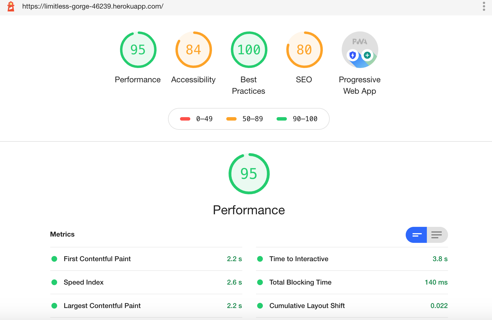

# PWA-Budget-Tracker
A PWA Application that allows users to easily manage and track their expenses and deposits at any time by allowing for offline functionality. 

## Functionality
Users will be able to add expenses and deposits to their budget whether they are online or offline. 
If a transaction is entered offline, they will be able to view this when they return to online mode. 

## User Story
As a traveller, 
I WANT to track my withdrawals and deposits with or without data/ an internet connection
SO THAT my account balance is accurately displayed in online and offline conditions. 

## Deployed Application
https://limitless-gorge-46239.herokuapp.com/

### Application working online

### Lighthouse Report 

### Application working offline. We have added a new deposit transaction - Stocks 

### This is added to the transaction history when the connection is back online
